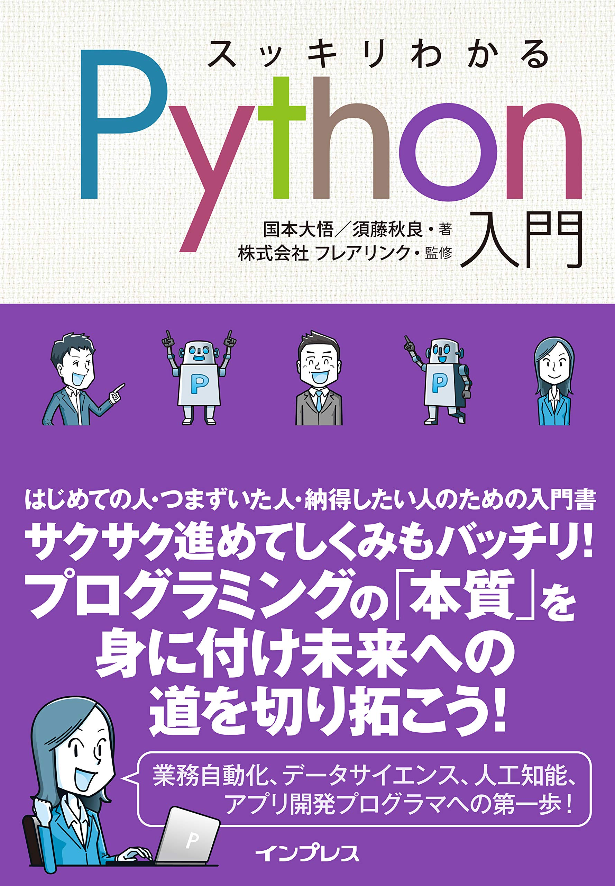

# INF206 
##### Programming
#### プログラミング

Week 1 | September 28, 2022

# Welcome.
<br>
<br>
<br>
<br>
<br>
<br>


# Join the class!

#### Step 1


### Step 2


# Hello!


## Call me "Yoh"


## 


[My journey](https://yohman.github.io/21S-DH151/Weeks/Week01/misc/me.html)

##

##

##


# Your turn! | あなたの番

- your name | 名前
- your passion | 最近ハマってるもの
- your research interest | 研究するとすればこんなことやってみたい

## My teaching philosophy<br>私の教育哲学
### 1: class = community

### 2: it's a two way street

Source: LA Times

### 3: sharing is caring


[Source: CDTA Law](https://cdtalaw.com/cdta/the-importance-of-sharing-knowledge-in-any-legal-context/)


# What is Programing?<br>プログラミングとは？

思い浮かぶものを[Jam Board](https://jamboard.google.com/d/16CLh2yYLeCkwERYYO3WkTgiYwGEZq2B1ZXXjps1EX7U/edit?usp=sharing)に書いてね

# Why Python?<br>なぜPythonなの？

#

# Pythonで何が作れる？

# 


## Schedule

## Schedule スケジュール

Week | Topic
--|--
Week 1 | オリエンテーション：プログラミングとは？
Week 2 | 第１章 変数とデータ型
Week 3 | 第２章 リスト、ディクショナリ、タプル、セット

###

Week | Topic 
--|--
Week 4 | 第３章 条件分岐、フローチャート-1-
Week 5 | 第３章 条件分岐、フローチャート-2-
Week 6 | 第４章 繰り返し-1-

###
Week | Topic
--|--
Week 7 | 第４章 繰り返し-2- 
Week 8 | 復習①
Week 9 | 第５章 関数

###
Week | Topic
--|--
Week 10 | 組み込み関数、モジュール
Week 11 | ファイル操作
Week 12 | Pandas, Numpy

###
Week | Topic
--|--
Week 13 | TBD
Week 14 | 演習問題

# Textbook｜教科書

##

【タイトル】
スッキリわかるPython入門

【著者】
国本大悟, 須藤秋良

【発行社】
インプレス

【定価】
2,640円（＋税）



# Grading｜成績評価

- 出席（15回） 30%
- 宿題 （10回）30% 
  - 回数は変わるかも
- テストもしくはプレゼン（２回） 40%

## 
出席 (1500 x 1/15 x 0.3)
 +
宿題 (500 x 1/5 x 0.3)
 +
プレゼン (200 x 1/2 x 0.4) 
 \=
 100

##
- 出席率60%以上で評価対象となります
(大学全体と同様)
- 宿題は期限までに出せば採点

###

Let's try some code
#### いきなりだけど、Pythonやりましょう！

###

go to
#### https://colab.research.google.com/

###


###

Add a title
ノートブックにタイトルを


###

Write some code
コートを書いてみよう


```python
print('hello world')
```
###


打ち終わったら　shift + enter

###


###

Let's do something advanced!
#### ではちょっとかっこいいことやろう

###

Import a library
ライブラリーをインポート

```python
import plotly.express as px
```

###

Write some code
コードを書こう

```python
fig = px.scatter(x=[0, 1, 2, 3, 4], y=[0, 1, 4, 9, 16])
fig.show()

```

###

ではColabでレポートを書こう

###
#### 🧐
そうなんです。ColabではPython Codeとテキストを両方同じページに出せる！

###


###

　
# 宿題

Collab Notebookを提出

# 必要最低項目：

### Introduction
- タイトルと自分の自己紹介（テキストブロック）
  - なぜコーディングを始めたいか
  - コーディングでどんなものを作りたいか

### Coding

- 今日習ったコーディングの課題をコードブロックを作成し、アウトプットを表示（２つ以上）
- クラスで習ってないコーディングの課題（教科書、もしくはWebなどで調べて）をコードブロックを作成し、アウトプットを表示（２つ以上）
- 各コードブロックの前に必ず説明をするテキストブロックを足すこと
- 各コードブロックのアウトプットの後に必ず結果を解釈するテキストブロックを足すこと


