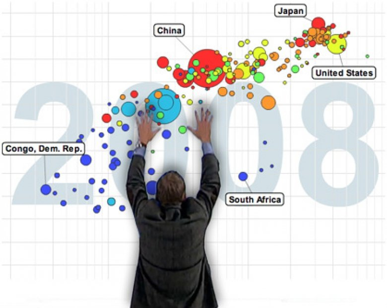

# INF206 
##### Programming
#### プログラミング

Week 3 | October 12, 2022

# What's up?😎
 

## Your homework

[Ryo](https://classroom.google.com/g/tg/NTI2OTk4ODI0NjEz/NTAyMzg1ODY2Mjk4#u=NzEyMTIyNTQ2OTla&t=f)

## 

[Miyu](https://classroom.google.com/g/tg/NTI2OTk4ODI0NjEz/NTAyMzg1ODY2Mjk4#u=NzEzNDgyMzg0NjFa&t=f)
## Today's coding topic

##

