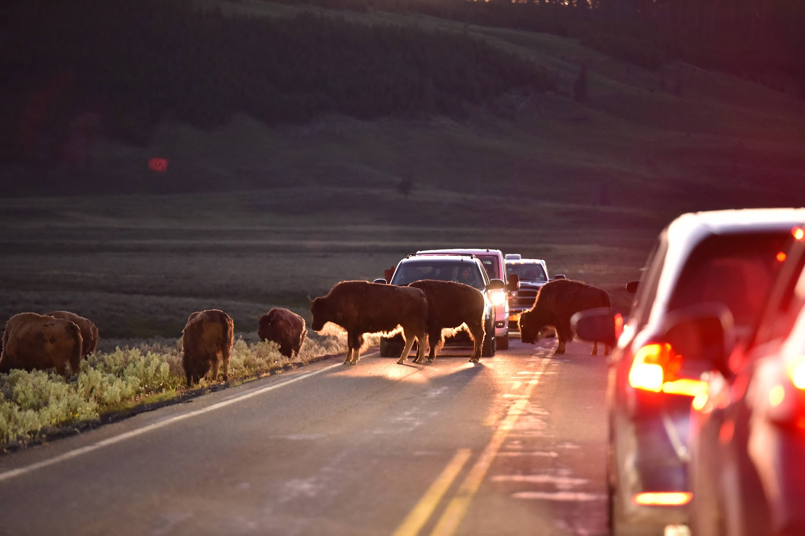

# INF206 
##### Programming
#### プログラミング

Week 5 | October 26, 2022

# What's up?😎
 
 
 
 
 
 
 
 
 

##

[bison親子](https://photos.app.goo.gl/UmhT5wgqPFya6JM38)
## Your homework

- [Miyu](https://colab.research.google.com/drive/1GTR65gXz2gF5xK447EzzuMnWGGzVP6Wf)
- [Airi](https://colab.research.google.com/drive/1JYcM2hhdvKEwPbw_tbWWp32cQLj6AUnG)
- [Ryo](https://colab.research.google.com/drive/1X1sbRgytSTTBdj7dnoqpb7xY5yUzL_ZJ)

## 先週のまとめ

##

##

##

## 先週の例題

https://colab.research.google.com/drive/1_Tj5g7y7xLZ850avnsHTYHXwZIMU4-QD

## Today's coding topic
for loop 繰り返し文

