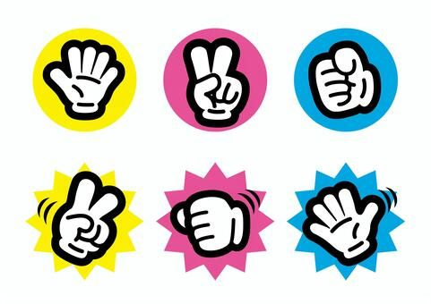

# INF206 
##### Programming
#### プログラミング

Week 7 | November 9, 2022


### <span style="color:white">My horrible weekend</span>😱

<br>
<br>
<br>
<br>
<br>
<br>
<br>
<br>
<br>
<br>


## Your homework


## Today's coding topic
じゃんけんゲーム



### UX（User Experience・ユーザー視点）
- プログラムを立ち上げたら、「じゃんけん」と表示し、ユーザーにグー✊、チョキ✌️、パー✋のいずれかを入力してもらう
- 入力した後にユーザーの手を表示し、同時にコンピューターの手を表示する
- 勝ち負けを把握し、どっちが勝ったかを表示する
- あいこならやり直す

### セットアップ

- https://colab.research.google.com/
- 新しいcolabファイルを作って「じゃんけん」というタイトルをつける


###

- 今までと違って、一つのコードブロックで全てのコードを記入する

### 初めは

- まずは「じゃんけん・・・・・」と```print()```を使って表示する

### hands（手）を登録

- ```hands = ["グー✊","チョキ✌️","パー✋"]```のリスト変数を作る
- 確認のため、```print()```を使って、それぞれリスト変数を使ってグー✊、チョキ✌️、パー✋を表示する

### プレーヤーの手 (player)

- ```int(input())```を使って、ユーザーに```数字で入力してね！>>0:グー✊ 1:チョキ✌️ 2:パー✋```を求める
- ユーザーの手を```player_hand```という変数に登録して、その変数を```print()```で表示する
- 表示するのは：「あなたは◯◯を出しました」

### コンピューターの手 (computer)

- ```import random```でライブラリーを導入（コードブロックの一番上に入れるのが適切）
- ```random.randrange(3)```でコンピューターの手（０、１、２）をランダムに決め、```computer_hand```変数に入れる
- コンピューターの手を```print()```で表示する
- 表示するのは：「コンピューターは◯◯を出しました」

### 条件分岐を使う
```if```と```elif```を使って勝ち負け、あいこを表示してみよう

<span style="font-size:0.8em">

|player|computer|win/loss|
|---|---|---|
|グー✊（０）| チョキ✌️（１）| player |
|グー✊（０）| パー✋（２）| computer|
|チョキ✌️（１）|グー✊（０）|computer|
|チョキ✌️（１）|パー✋（２）|player|
|パー✋（２）|グー✊（０） | player |
|パー✋（２）|チョキ✌️（１） | computer|

### 全ての組み合わせを考え、条件分岐（if, elif, elseなど）を使って勝ち負け```print()```で表示する

### 
もう一つの方法として、コンピューターの手からユーザーの手を引き算して、その結果を条件分岐を使って勝ち負けを表示する

###

あいこの時にプログラムを続けさせるために

```while True:```を使う

（条件分岐の所で勝負が決まった条件に```break```を足せば、```while```の牢屋から逃れる）