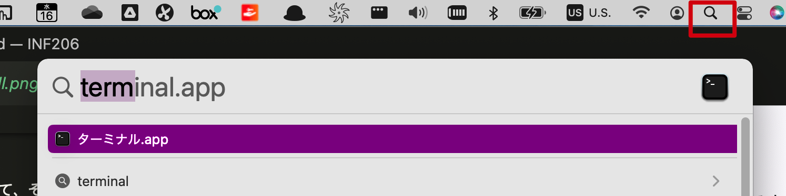
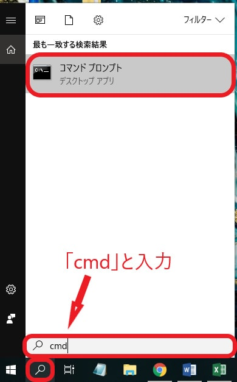

# INF206 
##### Programming
#### プログラミング

Week 9 | November 23, 2022


### <span style="color:white"></span>

<br>
<br>
<br>
<br>
<br>
<br>
<br>
<br>
<br>
<br>


### <span style="color:white"></span>

<br>
<br>
<br>
<br>
<br>
<br>
<br>
<br>
<br>
<br>


##

Review of last week

## 
Terminal (Mac)
Command Prompt (PC)

##



##


##
Mac
```bash
(base) yoh@mac ~ % 
```
PC
```bash
(base) C:\Users\xxx>
```

### Basic commands

<span style="font-size:0.8em">

|command|説明|mac/pc|
|:---|:---|---|
|pwd|今のディレクトリーを表示|両方
|ls |今のディレクトリーの中のファイルとフォルダーをリストアップ|Mac|
|dir |今のディレクトリーの中のファイルとフォルダーをリストアップ|PC|
|cd [folder name]|違うフォルダーに移る| 両方

## Python 環境

###  今まで：Google Colab


### Colabのメリットがいっぱい

- クラウド上でプログラミングが可能。
- 他？

##


## miniCONDA

https://conda.io/en/latest/miniconda.html#

##


### インストールの確認

Mac -> ターミナル

PC -> Anaconda Prompt


###

```bash
# pythonは？
(base) yoh@mac ~ % python -V
```
```bash
# condaは？
(base) yoh@mac ~ % conda -V
```

### 仮想環境の作成

```bash

(base) yoh@mac ~ % conda create -n reitaku python=3.8

```

↓

```Proceed ([y]/n)? y```
### 仮想環境の有効化

```bash

(base) yoh@mac ~ % conda activate reitaku

```
すると
↓
```bash

(reitaku) yoh@mac ~ % 

```
```(base)```が```(reitaku)```に変わった！

###


### 
```reitaku```環境にインストールされているパッケージ一覧
```bash
(reitaku) yoh@mac ~ % conda list
```

### プロジェクトフォルダーを作成

```bash
# 今どこ？
(reitaku) yoh@mac ~ % pwd
```

directoryをリストアップ
```bash
(reitaku) yoh@mac ~ % ls
```
directoryを変更
```bash
(reitaku) yoh@mac ~ % cd Desktop
```

###

directoryを作成
```bash
(reitaku) yoh@mac ~ % mkdir reitaku
```

そのdirectoryに移動
```bash
(reitaku) yoh@mac ~ % cd reitaku
```

###

python fileを作成
```bash
(reitaku) yoh@mac ~ % touch hello.py
```
###

```hello.py```ファイルがあるかどうかを確認
```bash
(reitaku) yoh@mac ~ % ls
```


### VSCode


### ダウンロードしよう

https://code.visualstudio.com/


## 用語の確認

- Python is a programming language

```
print("hello world")
```
###
- Colab/Jupyter notebooks allows you to write and execute python code along with text (easy to read and share!)

###
- Conda is software that allows you to create virtual environments so that you can write Python code

###
- VSCode is a text editor that allows you to write Python


## 関数　Functions

```python

def hello():
    print('Hello Reitaku')

```

```python
def hello(name):
    print("Hello " + name)

```

##


##


## Let`s Python in VSCode

